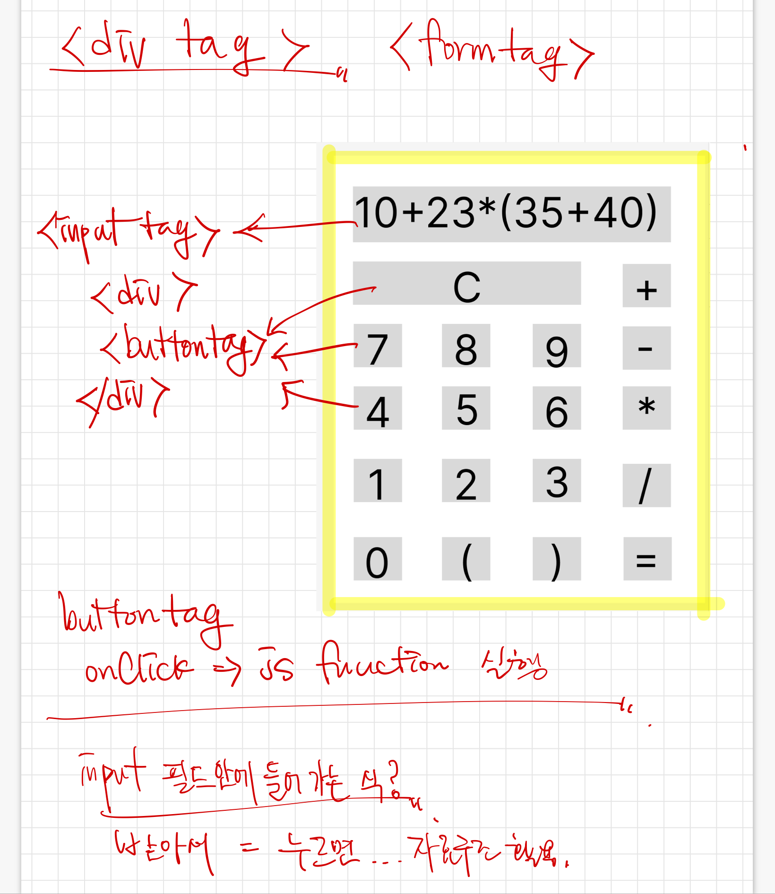

# 계산기 프로젝트
* css 개발
* js, html 개발
  

### 협의해야 할 것
  * DOM 구조 협의
  * 레이아웃 협의

### Slack과 GitHub 활용
  * 맨 처음 html, js / css 각자 생각하는 DOM 구조를 만드시고 Trello든, Slack을 활용해서든 올린다.
  * 이후 구조에 대한 협의를 대면으로 진행
  * DOM 구조 협의 이후에는 팀 별로 진행
  * 지금 당장 PM에게는 issue 제기를 Slack 메신저로 하고
  * 이후 미팅 협의를 한 후 대면 협의한다
  * 팀 별 github push는 pm의 코드리뷰 이후 진행

### html, js 개발자에게 요청드리는 것
  * TDD
    * tests html을 open하면 test라고 써져 있는 자바스크립트 속에 있는 test들이 실행된다. - 현재 jasmine

  * 알고리즘, 자료구조 구현

### css 개발자에게 요청드리는 것
  * cascading 이라는 것이 정확하게 무엇인지 알고 cascading 개념을 적용해서 디자인할것.
  * css에서 selector라는 것. 그리고 그 우선순위를 파악하고 디자인 적용할 것.
  * 화려하거나 예쁜것은 지금 상태에서 요구하지 않으나,DOM 구조를 파악하고 레이어를 따라 cascading하게 디자인을 적용했는지가 더 중요합니다.
